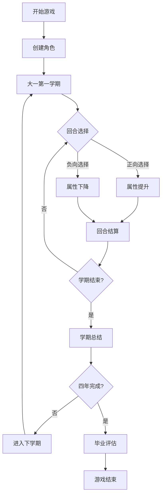

# 大学人生模拟游戏 - 产品需求文档

## 1. 产品概述

一款基于浏览器的大学生人生模拟游戏，玩家需要在大学四年中平衡学习、生活、社交、健康等多个维度，经历各种正向和负向事件，最终完成学业并为未来职业发展奠定基础。游戏通过回合制选择机制，让玩家体验大学生活的多样性，培养时间管理、决策能力和正确的价值观。

## 2. 核心功能

### 2.1 用户角色
| 角色 | 注册方式 | 核心权限 |
|------|----------|----------|
| 玩家 | 直接开始游戏，无需注册 | 扮演大学生，体验四年大学生活 |

### 2.2 核心属性系统

游戏包含以下六大核心属性，每种属性都有正向和负向事件影响其数值：

| 属性 | 初始值 | 说明 |
|------|--------|------|
| 学业成绩 | 60/100 | 学习成绩和学术表现 |
| 实践经验 | 40/100 | 实习、工作和职业技能 |
| 身心健康 | 70/100 | 身体和心理健康状态 |
| 社交能力 | 50/100 | 人际关系和社交技巧 |
| 社会贡献 | 30/100 | 志愿者活动和社会服务 |
| 综合能力 | 50/100 | 外语、心理素质、兴趣爱好等 |

### 2.3 正向事件（加分项）

- **学业成绩**：保持学习成绩良好、认真完成学业、积极参加课堂和学术活动、获得学术奖励
- **实践经验**：寻找实习和工作机会、获得实践经验和职业技能
- **领导能力**：参加学生组织、担任领导职务、获得领导经验
- **身心健康**：保持身心健康、积极参加体育运动、获得体育奖励
- **社交能力**：社交活跃、建立良好人际关系、获得社交支持
- **社会贡献**：参加志愿者活动、获得社会经验和服务精神
- **综合能力**：积极学习外语、拥有良好心理素质、爱好广泛

### 2.4 负向事件（减分项）

- **学业成绩**：长时间游戏、刷网剧等浪费时间、考试不及格、逃课旷课迟到
- **实践经验**：缺少实践经验和职业技能
- **时间管理**：喜欢拖延、没有做好实践管理
- **社交能力**：社交不当、建立不良人际关系
- **心理状态**：缺乏自信、无法适应挑战、心理问题如焦虑抑郁
- **人际关系**：舍友矛盾、恋爱问题
- **财务管理**：财务问题、无法承担学费和生活费用

## 3. 核心流程

### 3.1 游戏主流程

```
开始游戏
    ↓
创建角色（设置姓名、性别、选择专业）
    ↓
进入大一第一学期
    ↓
┌─────────────────────────────────┐
│  回合循环（每回合一个随机事件）   │
│  ├─ 展示当前状态                 │
│  ├─ 展示事件                     │
│  ├─ 玩家做出选择                 │
│  └─ 更新属性值                   │
└─────────────────────────────────┘
    ↓（每学期结束）
学期结算（显示本学期总结）
    ↓
进入下一学期
    ↓（四年八学期后）
毕业评估（显示最终成就和评价）
    ↓
结束游戏
```

### 3.2 Mermaid流程图



## 4. 用户界面设计

### 4.1 设计风格

- **整体风格**：现代学院风，融合游戏化元素
- **主色调**：深蓝色（#1e3a5f）为主色，金色（#d4af37）作为强调色
- **辅助色**：浅灰（#f5f5f5）背景，白色卡片，墨绿色（#2d5a4a）点缀
- **字体**：思源宋体（标题）+ 思源黑体（正文）的组合
- **布局**：中央仪表盘式设计，四周属性条围绕
- **动效**：平滑过渡动画，属性变化时有数值跳动效果

### 4.2 页面结构

| 页面 | 模块 | 功能描述 |
|------|------|----------|
| 开始页 | 标题动画、开始按钮 | 展示游戏标题和开始按钮 |
| 角色创建页 | 姓名输入、性别选择、专业选择 | 玩家自定义角色 |
| 游戏主页 | 属性面板、事件区域、选择按钮 | 展示当前状态和事件 |
| 学期结算页 | 雷达图、总结文字 | 展示本学期表现 |
| 毕业页 | 成就展示、总评 | 游戏最终结果 |

### 4.3 响应式设计

- 桌面端优先设计
- 平板和手机端自适应布局
- 触屏友好的按钮尺寸

## 5. 游戏数值设计

### 5.1 事件库设计

每个属性至少包含：
- 3个正向事件（+5~+15分）
- 3个负向事件（-5~-15分）

### 5.2 毕业条件

- 学业成绩 ≥ 40（可顺利毕业）
- 无任何属性 < 20（退学警告）

### 5.3 结局评级

根据六大属性的综合表现，分为：
- S级：全面优秀
- A级：多项突出
- B级：良好平衡
- C级：合格毕业
- D级：勉强毕业
- E级：未能毕业
