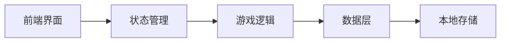

# 大学人生模拟游戏 - 技术架构文档

## 1. 架构设计

### 1.1 系统架构图



### 1.2 前端技术栈

- **框架**：React 18 + TypeScript
- **构建工具**：Vite
- **样式**：TailwindCSS
- **状态管理**：Zustand
- **图标**：Lucide React

## 2. 技术选型

| 类别 | 技术 | 说明 |
|------|------|------|
| 前端框架 | React 18 | 组件化开发 |
| 语言 | TypeScript | 类型安全 |
| 构建工具 | Vite | 快速开发体验 |
| 样式 | TailwindCSS | 原子化CSS |
| 状态管理 | Zustand | 轻量级状态管理 |
| 图标 | Lucide React | 开源图标库 |
| 存储 | localStorage | 本地数据持久化 |

## 3. 路由定义

| 路由 | 页面 | 说明 |
|------|------|------|
| / | 开始页 | 游戏入口 |
| /create | 角色创建页 | 设置角色信息 |
| /game | 游戏主页 | 核心游戏界面 |
| /semester-end | 学期结算页 | 学期总结 |
| /graduation | 毕业页 | 游戏结束 |

## 4. 数据模型

### 4.1 游戏状态

```typescript
interface GameState {
  playerName: string;
  gender: 'male' | 'female';
  major: string;
  currentYear: number;      // 1-4
  currentSemester: number;  // 1-2
  currentRound: number;     // 当前回合
  attributes: {
    academic: number;       // 学业成绩 0-100
    practice: number;       // 实践经验 0-100
    health: number;        // 身心健康 0-100
    social: number;         // 社交能力 0-100
    contribution: number;   // 社会贡献 0-100
   综合: number;           // 综合能力 0-100
  };
  history: EventRecord[];   // 历史事件记录
  isGameOver: boolean;
  graduationResult: GraduationResult | null;
}
```

### 4.2 事件数据结构

```typescript
interface GameEvent {
  id: string;
  title: string;
  description: string;
  choices: Choice[];
  affectedAttribute: keyof GameState['attributes'];
}

interface Choice {
  text: string;
  pointChange: number;
  followUpEvent?: string;
}
```

### 4.3 事件记录

```typescript
interface EventRecord {
  round: number;
  eventId: string;
  choiceIndex: number;
  pointChange: number;
}
```

## 5. 组件结构

```
src/
├── components/
│   ├── AttributePanel.tsx      # 属性面板
│   ├── EventCard.tsx           # 事件卡片
│   ├── ChoiceButton.tsx        # 选择按钮
│   ├── RadarChart.tsx          # 雷达图组件
│   └── SemesterSummary.tsx      # 学期总结组件
├── pages/
│   ├── StartPage.tsx           # 开始页
│   ├── CreateCharacterPage.tsx # 角色创建页
│   ├── GamePage.tsx             # 游戏主页
│   ├── SemesterEndPage.tsx      # 学期结算页
│   └── GraduationPage.tsx       # 毕业页
├── store/
│   └── gameStore.ts            # Zustand游戏状态
├── data/
│   └── events.ts               # 事件库数据
├── types/
│   └── index.ts                # TypeScript类型定义
├── App.tsx                     # 应用入口
└── main.tsx                    # 渲染入口
```

## 6. 事件库内容

### 6.1 学业成绩事件

**正向事件：**
1. "在期中考试中取得全系第一名" (+15)
2. "认真完成作业，被老师表扬" (+10)
3. "参加学术讲座，拓宽知识面" (+8)

**负向事件：**
1. "通宵打游戏，连续三天没去上课" (-15)
2. "期末考试两门不及格" (-12)
3. "经常逃课，被辅导员约谈" (-10)

### 6.2 实践经验事件

**正向事件：**
1. "获得世界500强企业实习offer" (+15)
2. "在学生会竞选中当选主席" (+12)
3. "参加编程竞赛获得一等奖" (+10)

**负向事件：**
1. "简历石沉大海，面试机会都没有" (-10)
2. "实习期间表现不佳被辞退" (-12)
3. "毕业前才发现没有任何实践经验" (-15)

### 6.3 身心健康事件

**正向事件：**
1. "坚持晨跑一学期，体测满分" (+12)
2. "在校运动会上获得跳远冠军" (+10)
3. "通过冥想和运动克服焦虑" (+8)

**负向事件：**
1. "长期熬夜追剧，身体免疫力下降" (-12)
2. "因抑郁情绪无法正常学习" (-15)
3. "暴饮暴食，体重飙升20斤" (-10)

### 6.4 社交能力事件

**正向事件：**
1. "在社团活动中结识志同道合的朋友" (+10)
2. "组织班级活动，获得同学好评" (+12)
3. "帮助同学解决困难，赢得信任" (+8)

**负向事件：**
1. "与室友发生激烈争吵，关系破裂" (-12)
2. "在朋友圈发表不当言论被孤立" (-10)
3. "恋爱分手后情绪崩溃" (-8)

### 6.5 社会贡献事件

**正向事件：**
1. "去山区支教一学期" (+15)
2. "参加冬奥会志愿者服务" (+12)
3. "为流浪动物保护中心募捐" (+10)

**负向事件：**
1. "只顾自己，从不参与公益活动" (-8)
2. "报名志愿者后无故缺席" (-10)

### 6.6 综合能力事件

**正向事件：**
1. "雅思考试获得8分" (+12)
2. "通过心理咨询学会情绪管理" (+10)
3. "培养摄影爱好，作品获奖" (+8)

**负向事件：**
1. "面对压力选择逃避" (-10)
2. "没有一项拿得出手的技能" (-8)
3. "财务危机，无力支付下学期学费" (-15)

## 7. 毕业评估算法

```typescript
function calculateGrade(state: GameState): string {
  const avg = Object.values(state.attributes).reduce((a, b) => a + b, 0) / 6;

  if (avg >= 85 && Object.values(state.attributes).every(v => v >= 70))
    return 'S';
  if (avg >= 75 && Object.values(state.attributes).every(v => v >= 60))
    return 'A';
  if (avg >= 65 && Object.values(state.attributes).every(v => v >= 50))
    return 'B';
  if (avg >= 55 && state.attributes.academic >= 40)
    return 'C';
  if (state.attributes.academic >= 40)
    return 'D';
  return 'E';
}
```
